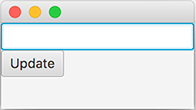
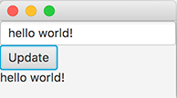

<text-box variant='learningObjectives' name='Oppimistavoitteet'>

- Tunnet käsitteen tapahtumankäsittelijä ja osaat käsitellä käyttöliittymän tapahtumia.

</text-box>


Edellä toteuttamamme käyttöliittymät eivät reagoi käyttöliittymässä tehtyihin tapahtumiin. Reagoimattomuus ei johdu käyttöliittymäkomponenteista, vaan siitä että emme ole lisänneet käyttöliittymäkomponentteihin tapahtumien käsittelyyn tarvittavaa toiminnallisuutta.

Nappien painaminen käsitellään [EventHandler](https://docs.oracle.com/javase/8/javafx/api/javafx/event/EventHandler.html)-rajapinnan toteuttavalla luokalla. Tapahtuman tyyppi on tällöin [ActionEvent](https://docs.oracle.com/javase/8/javafx/api/javafx/event/ActionEvent.html). Rajapinnan toteutukseen määritellään *mitä tehdään* silloin, kun käyttäjä painaa nappia.


```java
Button nappi = new Button("Tämä on nappi");
nappi.setOnAction(new EventHandler<ActionEvent>() {
    @Override
    public void handle(ActionEvent event) {
        System.out.println("Painettu!");
    }
});
```

Rajapinnan eksplisiittisen toteutuksen voi korvata halutessaan Lambda-lausekkeella.


```java
Button nappi = new Button("Tämä on nappi");
nappi.setOnAction((event) -> {
    System.out.println("Painettu!");
});
```

Kun edellä olevaa nappi painetaan, konsoliin tulostetaan teksti "Painettu!".


Käyttöliittymäkomponentteihin liitetyt **tapahtumankäsittelijät** kuten edellä käytetty EventHandler liittyvät aina tiettyihin käyttöliittymäkomponentteihin. Aina kun käyttöliittymäkomponentille tehdään toiminto, esimerkiksi napille napin painaminen, jokaista kyseiseen käyttöliittymäkomponenttiin liitettyä tapahtumankäsittelijää kutsutaan, ja niihin liittyvä ohjelmakoodi suoritetaan.


Haluamme usein että tapahtumankäsittelijä muokkaa jonkin olion tilaa. Päästäksemme olioon käsiksi, tulee tapahtumankäsittelijällä olla viite käsiteltävään olioon. Pohditaan seuraavaa käyttöliittymää jossa on kaksi tekstikenttää sekä nappi.


```java
@Override
public void start(Stage ikkuna) {
    TextField vasenTeksti = new TextField();
    TextField oikeaTeksti = new TextField();
    Button nappi = new Button("Kopioi");

    HBox komponenttiryhma = new HBox();
    komponenttiryhma.setSpacing(20);
    komponenttiryhma.getChildren().addAll(vasenTeksti, nappi, oikeaTeksti);

    Scene nakyma = new Scene(komponenttiryhma);

    ikkuna.setScene(nakyma);
    ikkuna.show();
}
```

Käyttöliittymän vasemmassa ja oikeassa laidassa on tekstikenttä. Tekstikenttien lisäksi käyttöliittymän keskellä on nappi, jossa on teksti "Kopioi".


Haluamme ohjelman, jossa vasemman tekstikentän sisältö kopioituu oikean kentän sisällöksi kun käyttäjä painaa nappia. Tämä onnistuu EventHandler-rajapinnan toteuttavan olion avulla.


```java
@Override
public void start(Stage ikkuna) {
    TextField vasenTeksti = new TextField();
    TextField oikeaTeksti = new TextField();
    Button nappi = new Button("Kopioi");

    nappi.setOnAction((event) -> {
        oikeaTeksti.setText(vasenTeksti.getText());
    });

    HBox komponenttiryhma = new HBox();
    komponenttiryhma.setSpacing(20);
    komponenttiryhma.getChildren().addAll(vasenTeksti, nappi, oikeaTeksti);

    Scene nakyma = new Scene(komponenttiryhma);

    ikkuna.setScene(nakyma);
    ikkuna.show();
}
```


Nyt nappia painettaessa vasemman tekstikentän sisältö kopioituu oikealla olevaan tekstikenttään.


Huom! Toteutettava metodi pystyy käyttämään metodin edellä määriteltyjä olioita, mikäli käytettävien olioiden arvoa ei aseteta ohjelmassa uudestaan yhtäsuuruusmerkillä (eli viitteet eivät muutu).


<!-- <programming-exercise name='Ilmoitin' tmcname='osa13-Osa13_06.Ilmoitin'> -->
<programming-exercise name='Notifier' tmcname='part13-Part13_06.Notifier'>


<!-- Toteuta tehtäväpohjassa olevaan luokkaan käyttöliittymä, jossa on kolme käyttöliittymäkomponenttia. Ylin komponentti on tekstikenttä (TextField), keskimmäinen komponentti nappi (Button), ja alin komponentti tekstikomponentti (Label). Asettele komponentit VBox-luokan avulla. Käyttöliittymän tulee näyttää (esimerkiksi) seuraavalta. -->

Create a user interface in the class included in the exercise template. It should contain three user interface components. The topmost is a text field (TextField), the middle one is a button (Button), and component on the bottom is a text component (Label). Lay out the components using the VBox class. The user interface should look kind of like the following.




<!-- Lisää tämän jälkeen sovellukseen toiminnallisuus, jossa napin painaminen johtaa siihen, että tekstikentän teksti kopioituu tekstikomponentin arvoksi. Alla olevassa esimerkissä tekstikenttään on kirjoitettu teksti "hei mualima!", jonka jälkeen nappia on painettu. -->

Then add functionality to the application, where pressing the button leads to the text in the text field being copied as the value of the text component. In the example below we have written the message "hello world!" into the text field, after which we have pressed the button.




</programming-exercise>


Käytettävä tapahtumankäsittelijä riippuu käyttöliittymäkomponentista, johon tapahtumankäsittelijä kytketään. Jos haluaisimme seurata tekstikenttään tapahtuvia muutoksia merkki merkiltä, käyttäisimme rajapintaa [ChangeListener](https://docs.oracle.com/javafx/2/api/javafx/beans/value/ChangeListener.html).  Alla olevassa esimerkissä vasempaan tekstikenttään on kytketty rajapinnan ChangeListener toteuttava olio, joka sekä tulostaa muutokset tekstikonsoliin että asettaa aina uuden arvon oikealla olevaan tekstikenttään.


```java
vasenTeksti.textProperty().addListener(new ChangeListener<String>() {
    @Override
    public void changed(ObservableValue<? extends String> muutos,
            String vanhaArvo, String uusiArvo) {

        System.out.println(vanhaArvo + " -> " + uusiArvo);
        oikeaTeksti.setText(uusiArvo);
    }
});
```


Edellä muutoksia havainnoidaan tekstikenttään liittyvästä tekstistä. Koska teksti on merkkijonomuotoista, on muutoksia käsittelevälle rajapinnalle annettu tyypiksi merkkijono. Kuten edellä, myös tässäkin esimerkissä ohjelmakoodi voidaan esittää lyhyemmässä muodossa.


```java
vasenTeksti.textProperty().addListener((muutos, vanhaArvo, uusiArvo) -> {
    System.out.println(vanhaArvo + " -> " + uusiArvo);
    oikeaTeksti.setText(uusiArvo);
});
```


Ohjelma voi tehdä myös tilastointia. Edellisessä tehtävässä luotujen tekstikenttien arvot saa laskettua melko suoraviivaisesti. Alla olevaa esimerkkiä noudattaen arvot päivittyisivät aina kun käyttäjä muuttaa tekstikentän sisältöä.


```java
vasenTeksti.textProperty().addListener((muutos, vanhaArvo, uusiArvo) -> {
    int merkkeja = uusiArvo.length();
    String[] palat = uusiArvo.split(" ");
    int sanoja = palat.length;
    String pisin = Arrays.stream(palat)
        .sorted((s1, s2) -> s2.length() - s1.length())
        .findFirst()
        .get();

    // asetetaan arvot tekstielementteihin
});
```


<!-- <programming-exercise name='Tekstitilastointia, osa II' tmcname='osa13-Osa13_07.TekstitilastointiaOsa2'> -->
<programming-exercise name='Text statistics, part II' tmcname='part13-Part13_07.TextStatisticsPart2'>


<!-- Kopioi tehtävässä Tekstitilastointia tekemäsi toteutus tehtäväpohjassa olevaan luokkaan ja liitä mukaan yllä olevassa esimerkissä oleva toiminnallisuus tilastojen laskemiseen. Lopputuloksena ohjelman pitäisi laskea kirjoitetusta tekstistä tilastoja, jotka päivittyvät automaattisesti sovellukseen. -->

Copy the work you did in the Text statistics exercise into the class included in the exercise template and add to it the functionality from the example above for calculating the statistics. The end result should an application that calculates statistics based on text that is input, which are updated automatically and displayed in the application.


</programming-exercise>
