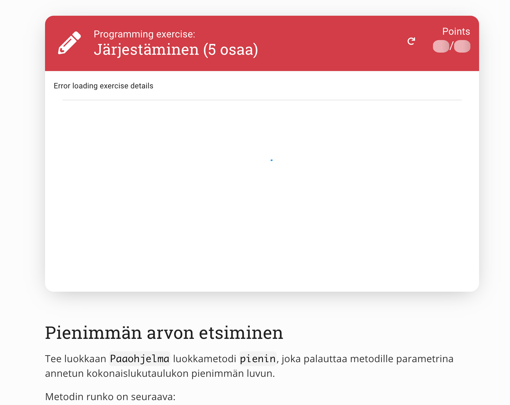
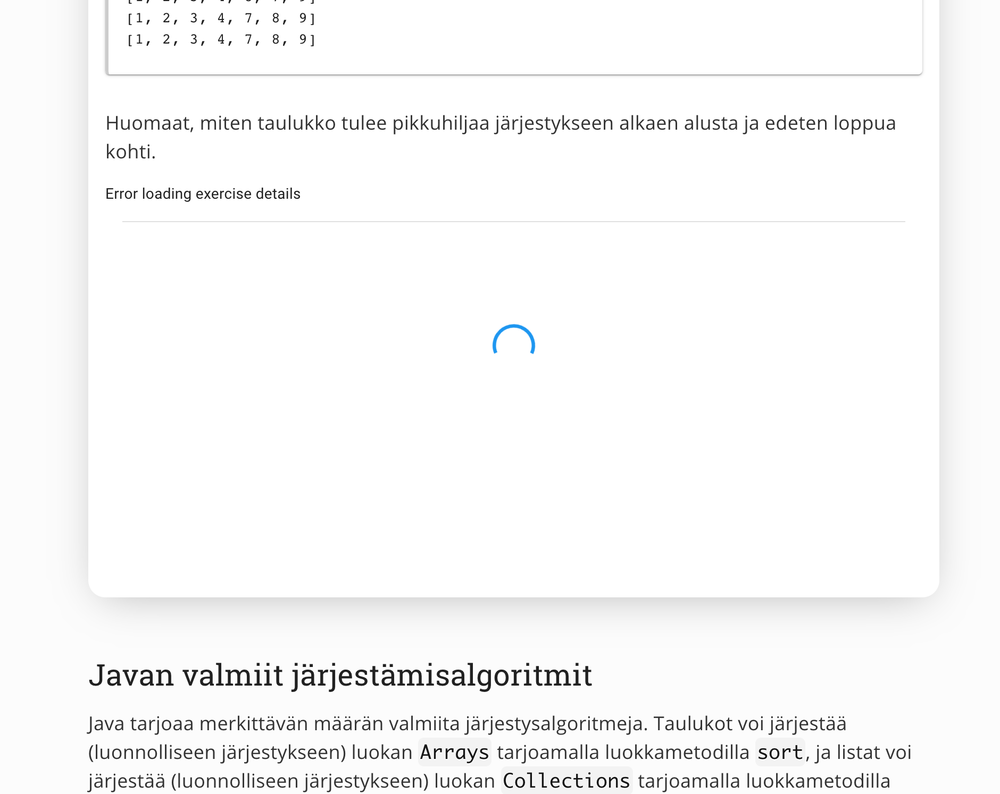
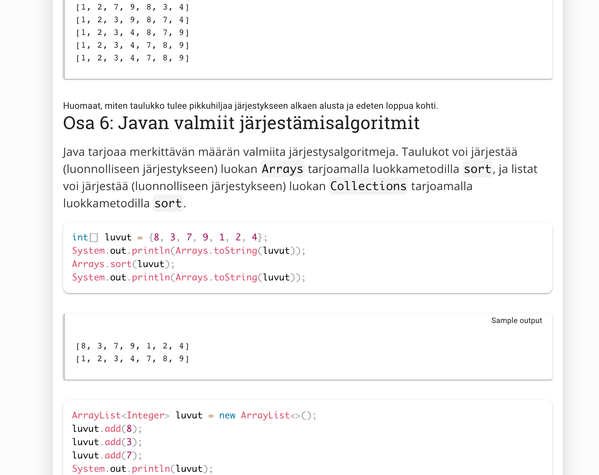
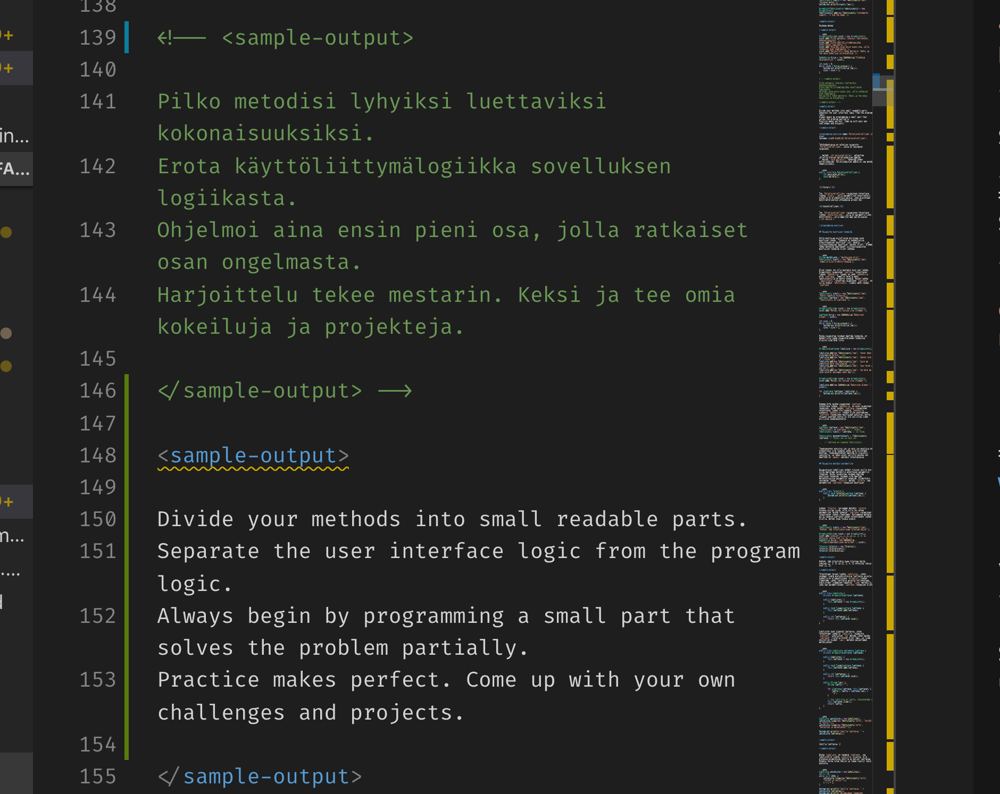
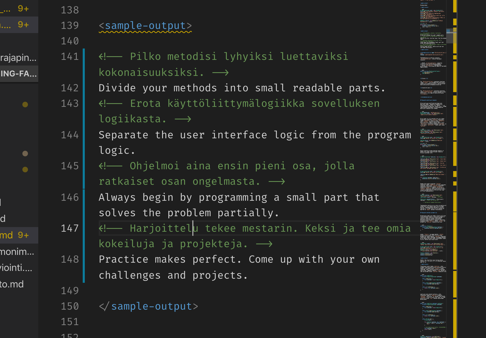

# Materiaalin kääntämisohje


## Esivalmistelut

### Käännettävä materiaali (suomeksi) ajan tasalla?

Käännämme repon [ohjelmointi-20](https://github.com/rage/ohjelmointi-20) perusteella. Suomenkielistäkin materiaalia käydään vielä läpi, joten kyseinen repo tulee päivittymään. Synkkaus tämän repon kanssa (esim. ennen osan 7 kääntämistä pitää tämän repon suomenkieliset tekstit kopioida tuolta reposta) pitää hoitaa manuaalisesti. Tarvitaan harvoin (kun uutta suomalaista materiaalia ilmestyy).

## Valmistelu


### Varaus Drivestä
* Varmista Drivestä, että kukaan muu ei ole varannut osaa, jonka haluat kääntää
* Merkkaa nimesi kääntäjän paikalle


### Työskentely-ympäristö
* Kloonaa repo paikallisesti, jolloin on helpompi testata miltä lopullinen materiaali tulee näyttämään. Käynnistetään komennoilla
  `npm ci`  ja `npm run develop`

* Tee uusi branch, jossa tulet työskentelemään. Voit tietenkin myös forkata erillisen repon, mutta pelkän branchin käyttäminen saattaa helpottaa käännösprosessin seuraamista (kaikki saman repon alla)
* Suositellaan Visual Studio Codea. Käteviä asetuksia ja vinkkejä löytyy käännösdriven 'Guide'-välilehdestä.


## Itse kääntäminen

Tiedostot löytyvät data-kansion alta, niin että jokaista osaa vastaa oma kansionsa. Näissä kansioissa alaosat ovat omina .md-tiedostoinaan. Md-tiedoston nimen voi muuttaa englanniksi halutessaan, mutta ne on myös nopea tarkastaa lopuksi ennen osan julkaisemista. Tekstin lisäksi materiaalissa esiintyy erilaisia partiaaleja (esim. `<sample-output>...</sample-output>`).

#### Partiaalit ovat tarkkoja omasta tilastaan

Yritä huolehtia, että käännös säilyttää mahdollisimman uskollisesti rivinvaihdot. Osa partiaaleista tuntuu ainakin vaativan tyhjän rivin ennen niitä. Esimerkiksi `programming-exercise` on tällainen. (**Tässä vain esimerkkinä**. Tehtäviä ei tarvitse kääntää muun materiaalin yhteydessä, vaan tämä tehdään eri kerralla. Rivinvaihtoasia pätee kuitenkin yleisesti.)

Alku oikein (tyhjä rivi ennen `<programming-exercise ...>`-alkutagia):


Alku väärin (ei tyhjää riviä ennen alkutagia):


Loppu oikein (tyhjä rivi ennen `</programming-exercise>`-lopputagia):


Loppu väärin (ei tyhjää riviä ennen lopputagia):


Jos materiaalin asettelu on hyvin omituisen näköinen, todennäköisesti syy on tässä tai puuttuvissa avaus- tai sulkutageissä.

### Teknisesti huomioitavaa kääntämisestä

#### Find and replace

Koodinpätkää kääntäessä ei ole kovin hauskaa kopioida muuttujien nimiä moneen kertaan. Kannattaa hyödyntää Visual Coden replace-ominaisuutta (ctrl + h Windowsilla, tai edit->replace). Sijoita muuttujan suomenkielinen nimi haettavaksi ja englanninkielinen korvaajaksi, ja muutokset on nopeaa naksutella.


#### Kommentointiohjeistus

Älä kumita suomenkielistä tekstiä, vaan kommentoi se piiloon. Napauta kommentoitavaa riviä ja valitse Edit -> Toggle Line Comment (ainakin Windowsilla mm. Ctrl + K, Ctrl + U kommentoi rivin). Kirjoita kommentoidun osan alle sama teksti suomeksi. Tämä ohje pätee suureen osaan tekstistä, mutta tietyissä tapauksissa on oltava tarkkana...

Ainakin `<sample-output>...</sample-output` ja ` ```... ``` ` väleissä sijaitsevat materiaali on **kommentoitava pois kokonaisuutena** ja kirjoitettava uusi sisältö tageineen alle. Pelkkä rivi riviltä kommentoiminen ja kääntäminen alueen sisällä ei ole hyvä ratkaisu. Koodialueella kommentit näkyisivät, ja sample-output-alueella jokainen kommentti aiheuttaa tyhjän rivin, mikä voi johtaa harhaan (onhan kyseessä esimerkkituloste, jota seurataan tarkoin). Siis tee **näin**:


, **ei näin**:



#### Tehtävien kääntäminen (PÄIVITETTY)

Kun käännät tekstin, **älä käännä** tehtäviä. Ne katsotaan erikseen ennen kuin itse tehtäväpohja käännetään.

Jos käännät tehtävien nimiä (ei siis muun käännöksen ohessa): Kun olet kääntänyt ohjelmointitehtävän(`<programming-exercise>...</programming-exercise>`), merkkaa Drivessä olevaan listaan valitsemasi englanninkielinen nimi.

#### Epäselvä nimestä / pitää nimetä jotain toistuvaa (tarkista / merkkaa driveen)

Osa termeistä saattaa olla haastavia käännettäviä. Kannattaa tarkastaa Driven Dictionary-taulukko, johon on koottu aiemmin käytettyjä käännöksiä. Voit lisätä itse käyttämiäsi valintoja, joita käyttämällä muut voivat tuottaa yhdenmukaisempaa tekstiä.

## Kun olet kääntänyt osan loppuun

Puske muutokset GitHubiin ja tee Pull Request. Päivitä edistymisesi Driveen.

## Kun koko osa (part) on valmiina

Tämä tehdään vain kun lähestytään osan julkaisua kurssille osallistuneille. Useimmiten kääntäessä ei siis tarvitse huolehtia mistään seuraavasta.

### Julkaise tehtävät

Ohjeet löytyvät tehtäväreposta.

### Katso että tehtävät latautuvat materiaalissa oikein

Avaa materiaali, ja katso että jokaisessa tehtävässä saatavilla olevat pisteet latautuvat. Tällöin tmc-nimi on oikein kirjoitettu. Muutoin tarkasta `programming-exercise`-tagi, ja että siinä ei ole suomea ja on tehtävän oikea nimi. Virhe saattaa olla myös itse tehtävässä -- katso tmc:stä millä nimellä tehtävä on sinne ladattu.

### Laita osan materiaalit julkiseksi

Jokaisen .md-tiedoston yläosassa on osio, joka todennäköisesti on `hidden: true`. Muuta tämä muotoon `hidden: false`. **Huom!** Älä vain poista koko hidden-osaa, vaikka se vaikuttaisikin tekevän saman asian!

### Poista placeholder tulevista päivämääristä

Repon juuressa on tiedosto `course-settings.js`. Poista luettelosta `sidebarFuturePages` se kurssin osa, jota olet julkaisemassa.

## Epäselvyyksiä / kommentteja / parannusta

Saa muokata ja lisätä huomattuja hyödyllisiä vinkkejä. Jos jokin ei ohjeen tai oman pähkäilyn perusteella selviä, voi kysyä käännösryhmän jonkin kanavan kautta muiden mielipidettä - välillä erikoinen suomenkielinen materiaali aiheuttaa pähkäiltävää.